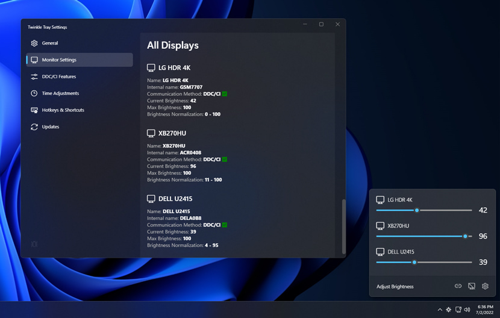
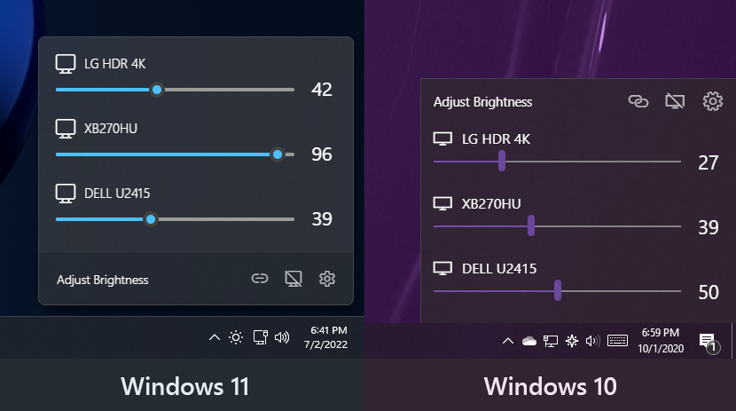
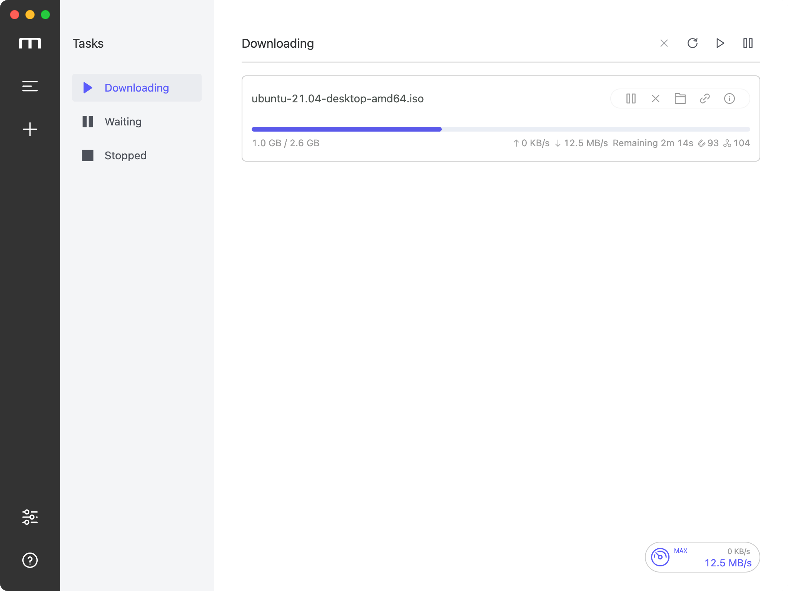

# 第一章：屏幕调节软件

## 1.1 概述

* 对于程序员来说，一般都是使用台式机的，但是台式机调节亮度和对比度等太麻烦了，可以使用如下的软件（twinkle-tray）做到像笔记本电脑那样通过软件来调节。

## 1.2 项目

* 项目截图：

* [项目地址](https://github.com/xanderfrangos/twinkle-tray)。

## 1.3 平台（操作系统）

* 支持的平台：

| 平台    | 是否支持 |
| ------- | -------- |
| Windows | √        |
| Linux   | ×        |
| Mac     | ×        |

# 第二章：下载软件

## 2.1 概述

* Motrix 是一款功能全面的下载管理工具，支持多种下载协议，包括 HTTP、FTP、BitTorrent（BT）、磁力链等。

## 2.2 项目

* 项目截图：

* [官网](https://motrix.app/)。
* [项目地址](https://github.com/agalwood/Motrix)。

## 2.3 平台（操作系统）

* 支持的平台：

| 平台    | 是否支持 |
| ------- | -------- |
| Windows | √        |
| Linux   | √        |
| Mac     | √        |

