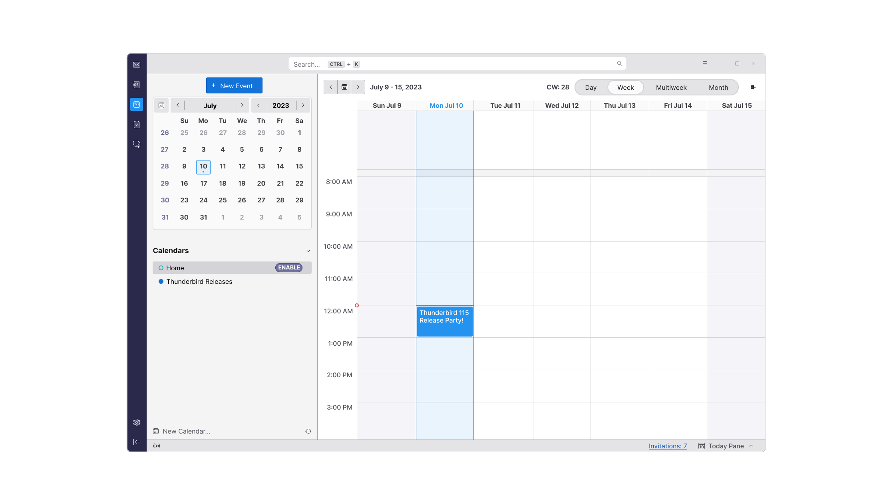
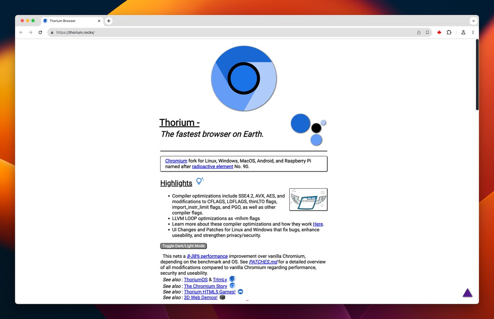
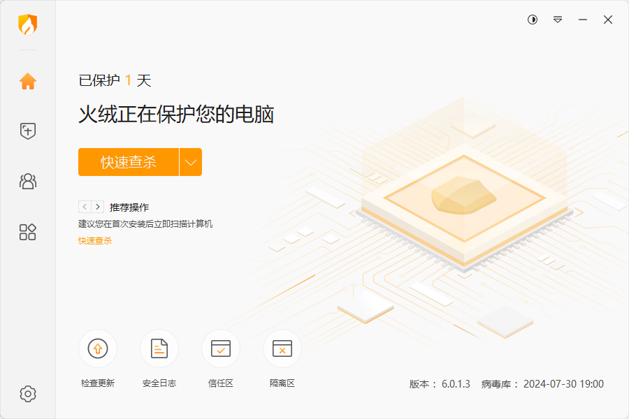
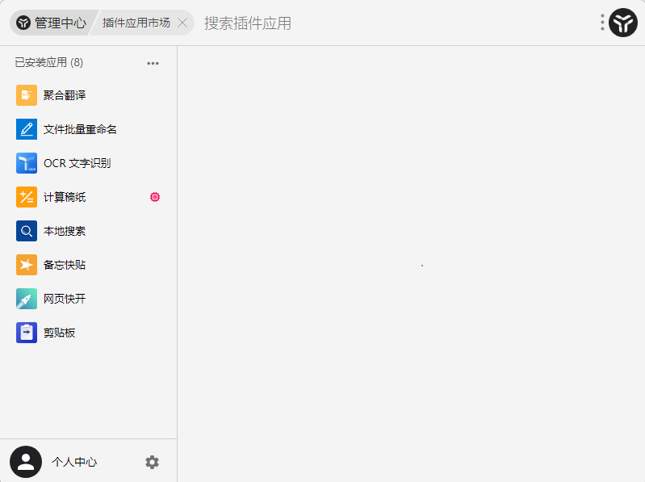
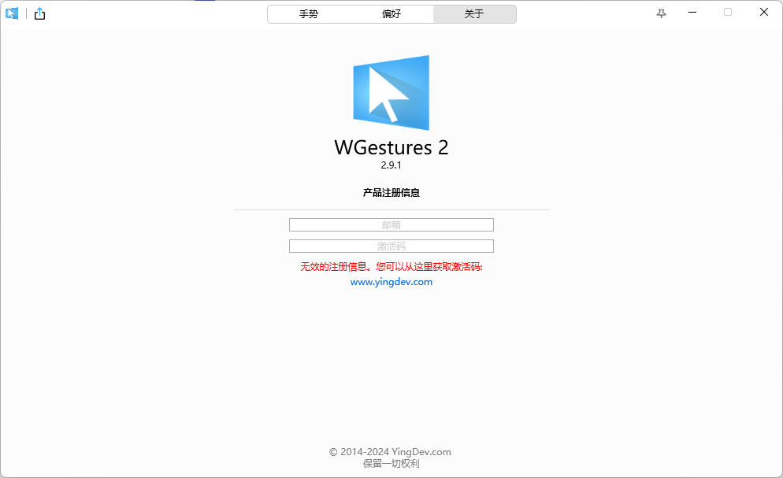

# 第一章：屏幕调节软件

## 1.1 概述

* 对于程序员来说，一般都是使用台式机的，但是台式机调节亮度和对比度等太麻烦了，可以使用如下的软件（twinkle-tray）做到像笔记本电脑那样通过软件来调节。

## 1.2 项目

* 项目截图：

* [项目地址](https://github.com/xanderfrangos/twinkle-tray)。

## 1.3 平台（操作系统）

* 支持的平台：

| 平台    | 是否支持 |
| ------- | -------- |
| Windows | ✅        |
| Linux   | ❎        |
| Mac     | ❎        |

# 第二章：下载软件

## 2.1 Motrix 

### 2.1.1 概述

* Motrix 是一款功能全面的下载管理工具，支持多种下载协议，包括 HTTP、FTP、BitTorrent（BT）、磁力链等。

### 2.1.2 项目

* 项目截图：

* [官网](https://motrix.app/)。
* [项目地址](https://github.com/agalwood/Motrix)。

### 2.1.3 平台（操作系统）

* 支持的平台：

| 平台    | 是否支持 |
| ------- | -------- |
| Windows | ✅        |
| Linux   | ✅        |
| Mac     | ✅        |

## 2.2 Neat Download Manager

### 2.2.1 概述

* Neat Download Manager 是一款免费的下载管理器，它可以帮助用户更高效地下载文件，其主要功能和特点，如下所示：
  * ① **多线程下载**：Neat Download Manager支持多线程下载技术，将一个文件分成多个部分同时下载，从而显著提高下载速度。

  * ② **下载恢复**：该软件支持断点续传功能，用户可以在下载中断后继续下载，而无需重新开始。

  * ③ **浏览器集成**：Neat Download Manager可以与流行的浏览器（如：Chrome、Firefox、Edge）集成，自动捕获和管理下载链接。

  * ④ **带宽控制**：用户可以设置下载带宽限制，以确保下载任务不会占用全部带宽，影响其他网络活动。

  * ⑤ **批量下载**：该软件允许用户一次性下载多个文件，适合需要下载大量文件的用户。

  * ⑥ **队列管理**：用户可以管理下载队列，设置下载任务的优先级，安排下载时间等。

  * ⑦ **支持多种协议**：Neat Download Manager支持HTTP、HTTPS和FTP协议，可以下载来自各种来源的文件。

  * ⑧ **简洁界面**：该软件的用户界面设计简洁直观，易于使用，即使是初学者也能快速上手。

### 2.2.2 项目

* 项目截图：

* [官网](https://www.neatdownloadmanager.com/)。

### 3.2.3 平台（操作系统）

* 支持的平台：

| 平台    | 是否支持 |
| ------- | -------- |
| Windows | ✅        |
| Linux   | ✅        |
| Mac     | ✅        |

# 第三章：邮件软件

## 3.1 Thunderbird

### 3.1.1 概述

* Thunderbird 是由 Mozilla 基金会开发的一款免费的开源电子邮件客户端。它具有以下一些主要特点：
  1. **多账户支持**：Thunderbird 允许用户同时管理多个电子邮件账户，包括 IMAP 和 POP 邮箱。
  2. **安全性**：提供强大的垃圾邮件过滤和反钓鱼保护功能，可以有效保护用户的隐私和数据安全。
  3. **自定义功能**：用户可以通过各种插件和扩展来增强和定制 Thunderbird 的功能。
  4. **跨平台**：支持 Windows、macOS 和 Linux 操作系统。
  5. **日历和任务管理**：通过附加组件 Lightning 提供集成的日历和任务管理功能。
  6. **标签和过滤器**：用户可以使用标签和过滤器来组织和管理邮件，提高工作效率。
* Thunderbird 的目标是为用户提供一个简单、安全、强大且可定制的邮件管理工具，是许多用户的首选邮件客户端。

### 3.1.2 项目

* 项目截图：

* [官网](https://www.thunderbird.net/zh-CN/)。

### 3.1.3 平台（操作系统）

* 支持的平台：

| 平台    | 是否支持 |
| ------- | -------- |
| Windows | ✅        |
| Linux   | ❎        |
| Mac     | ✅        |

# 第四章：浏览器

## 4.1 Thorium

### 4.1.1 概述

* Thorium 是一个基于 Chromium 的浏览器，适用于 Linux、Windows、MacOS、Android 和 Raspberry Pi 等多种平台。它通过编译优化（如： SSE4.2、AVX 和 AES 等）和 UI 改进，提升了性能和用户体验。
* 相比标准的 Chromium，Thorium 在不同基准测试和操作系统下可提升 8-38% 的性能。该浏览器还注重隐私和安全性，提供一系列附加功能和修复。

### 4.1.2 项目

* 项目截图：

* [官网](https://thorium.rocks/)。

### 4.1.3 平台（操作系统）

* 支持的平台：

| 平台    | 是否支持 |
| ------- | -------- |
| Windows | ✅        |
| Linux   | ✅        |
| Mac     | ✅        |

# 第五章：防火墙

## 5.1 火绒

### 5.1.1 概述

* 火绒安全软件（Huorong）是一款由中国公司火绒信息技术有限公司开发的电脑安全软件。该软件提供了全面的安全保护，包括防病毒、防火墙、系统优化和网络保护等功能。火绒的特点是轻量级、低资源占用和高效的病毒查杀能力，同时具备较强的自定义能力和用户友好的界面。

### 5.1.2 项目

* 项目截图：

* [官网](https://www.huorong.cn/)。

### 5.1.3 平台（操作系统）

* 支持的平台：

| 平台    | 是否支持 |
| ------- | -------- |
| Windows | ✅        |
| Linux   | ❎        |
| Mac     | ❎        |

# 第六章：效率工具

## 6.1 utools

### 6.1.1 概述

* uTools 是一款由中国开发者推出的多功能效率工具，旨在提升用户的工作和生活效率。

### 6.1.2 项目

* 项目截图：

* [官网](https://www.u.tools/)。

### 6.1.3 平台（操作系统）

* 支持的平台：

| 平台    | 是否支持 |
| ------- | -------- |
| Windows | ✅        |
| Linux   | ❎        |
| Mac     | ✅        |

## 6.2 WGestures

### 6.2.1 概述

* WGestures 是一款基于 Windows 平台的手势识别软件，旨在通过鼠标手势来提升用户的操作效率。

### 6.2.2 项目

* 项目截图：

* [官网](https://www.yingdev.com/)。
* [项目地址](https://github.com/yingdev)。

### 6.2.3 平台（操作系统）

* 支持的平台：

| 平台    | 是否支持 |
| ------- | -------- |
| Windows | ✅        |
| Linux   | ❎        |
| Mac     | ✅        |
