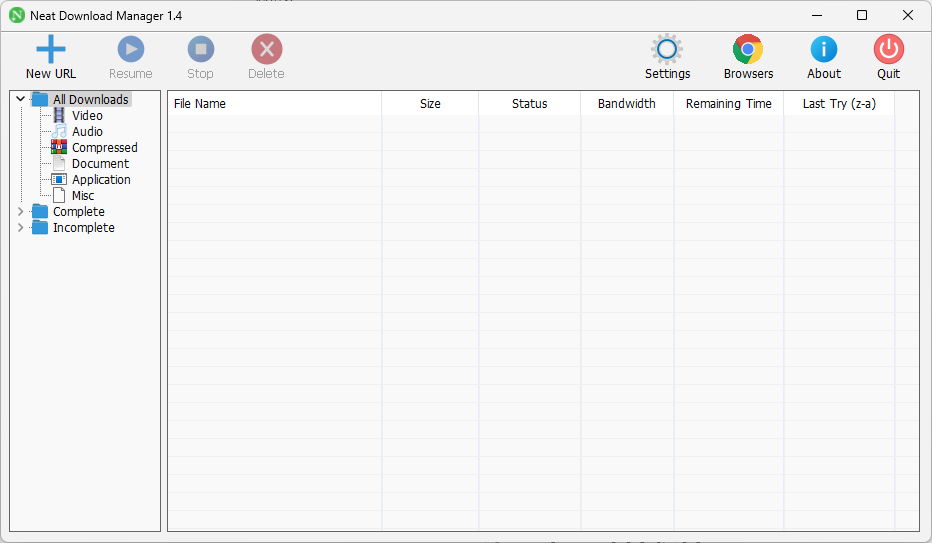

# 第一章：屏幕调节软件

## 1.1 概述

* 对于程序员来说，一般都是使用台式机的，但是台式机调节亮度和对比度等太麻烦了，可以使用如下的软件（twinkle-tray）做到像笔记本电脑那样通过软件来调节。

## 1.2 项目

* 项目截图：

* [项目地址](https://github.com/xanderfrangos/twinkle-tray)。

## 1.3 平台（操作系统）

* 支持的平台：

| 平台    | 是否支持 |
| ------- | -------- |
| Windows | ✅        |
| Linux   | ❎        |
| Mac     | ❎        |

# 第二章：下载软件

## 2.1 概述

* Motrix 是一款功能全面的下载管理工具，支持多种下载协议，包括 HTTP、FTP、BitTorrent（BT）、磁力链等。

## 2.2 项目

* 项目截图：

* [官网](https://motrix.app/)。
* [项目地址](https://github.com/agalwood/Motrix)。

## 2.3 平台（操作系统）

* 支持的平台：

| 平台    | 是否支持 |
| ------- | -------- |
| Windows | ✅        |
| Linux   | ✅        |
| Mac     | ✅        |

# 第三章：邮件收件箱

## 3.1 概述

* Thunderbird 是由 Mozilla 基金会开发的一款免费的开源电子邮件客户端。它具有以下一些主要特点：
  1. **多账户支持**：Thunderbird 允许用户同时管理多个电子邮件账户，包括 IMAP 和 POP 邮箱。
  2. **安全性**：提供强大的垃圾邮件过滤和反钓鱼保护功能，可以有效保护用户的隐私和数据安全。
  3. **自定义功能**：用户可以通过各种插件和扩展来增强和定制 Thunderbird 的功能。
  4. **跨平台**：支持 Windows、macOS 和 Linux 操作系统。
  5. **日历和任务管理**：通过附加组件 Lightning 提供集成的日历和任务管理功能。
  6. **标签和过滤器**：用户可以使用标签和过滤器来组织和管理邮件，提高工作效率。
* Thunderbird 的目标是为用户提供一个简单、安全、强大且可定制的邮件管理工具，是许多用户的首选邮件客户端。

## 3.2 项目

* 项目截图：

* [官网](https://www.thunderbird.net/zh-CN/)。

## 3.3 平台（操作系统）

* 支持的平台：

| 平台    | 是否支持 |
| ------- | -------- |
| Windows | ✅        |
| Linux   | ✅        |
| Mac     | ✅        |

# 第四章：浏览器（Thorium）

## 4.1 概述

* Thorium 是一个基于 Chromium 的浏览器，适用于 Linux、Windows、MacOS、Android 和 Raspberry Pi 等多种平台。它通过编译优化（如： SSE4.2、AVX 和 AES 等）和 UI 改进，提升了性能和用户体验。
* 相比标准的 Chromium，Thorium 在不同基准测试和操作系统下可提升 8-38% 的性能。该浏览器还注重隐私和安全性，提供一系列附加功能和修复。

## 4.2 项目

* 项目截图：

* [官网](https://thorium.rocks/)。

## 4.3 平台（操作系统）

* 支持的平台：

| 平台    | 是否支持 |
| ------- | -------- |
| Windows | ✅        |
| Linux   | ✅        |
| Mac     | ✅        |
