# 第一章：SDK 和 IDE

## 1.1 概述

### 1.1.1 SDK

* `定义`：SDK（Software Development Kit） 是一个集合，包括软件开发所需的工具、库、文档和示例代码。它通常用于特定的平台或框架。
* `功能`：
  - ① 提供编程接口（API），允许开发者与平台或服务进行交互。
  - ② 包含调试工具和测试工具，帮助开发者检测和修复错误。
  - ③ 提供文档和示例代码，指导开发者如何使用 SDK。
  - ④ ...

> [!CAUTION]
>
> * ① 虽然 Node.js 提供了一些工具和库，但它更关注于提供一个运行环境，类似于浏览器，如：Chrome 等；而不是像 SDK 那样全面集成的工具集合。
> * ② SDK 通常包含特定平台或框架的 API、文档和示例代码。
> * ③ 尽管 Node.js 包含了一些开发所需的组件，但它并不完全符合 SDK 的定义。


* 示例：

```shell
Android SDK # 用于开发 Android 应用的工具包
```


* 示例：

```shell
.NET SDK # 用于构建和运行 .NET 应用的工具
```

### 1.1.2 IDE

- `定义`：IDE（Integrated Development Environment）是一种软件应用，提供综合的环境以便进行软件开发。它集成了代码编辑器、调试器和构建自动化工具。
- `功能`：
  - ① 代码编辑：提供语法高亮、自动补全和代码格式化等功能。
  - ② 调试：允许开发者在代码中设置断点，逐步执行代码以检查逻辑。
  - ③ 版本控制集成：支持 Git 等版本控制系统的功能。
  - ④ 界面友好：通常具有图形用户界面，使得开发更直观。
  - ⑤ ...


* 示例：

```shell
Visual Studio # 用于开发 .NET 和其他应用的 IDE
```


* 示例：

```shell
IntelliJ IDEA # 用于 Java 和其他语言的 IDE
```

## 1.2 Node.js

* Node.js 是一个免费、开源、跨平台的 JavaScript 运行时环境，它让开发人员能够创建服务器、Web 应用、命令行工具和脚本。

* 项目截图：


> [!IMPORTANT]
>
> * [官网](https://nodejs.org/zh-cn)。
> * [项目地址](https://github.com/nodejs/node)。

- 支持的平台：

| 平台    | 是否支持 |
| :------ | :------- |
| Windows | ✅        |
| Linux   | ✅        |
| Mac     | ✅        |

## 1.3 IDE（集成开发环境）

### 1.3.1 Visual Studio Code（VsCode）

* Visual Studio Code 是一个轻量级但功能强大的源代码编辑器，可在桌面上运行，适用于 Windows、macOS 和 Linux。它内置了对 JavaScript、TypeScript 和 Node.js 的支持，并具有针对其他语言和运行时（如 C++、C#、Java、Python、PHP、Go、.NET）的丰富扩展生态系统。

> [!NOTE]
>
> 微软开发的文本编辑器，开源且免费！！！

* 项目截图：

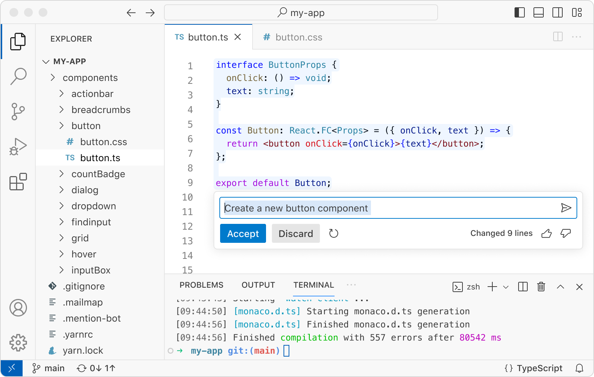

> [!IMPORTANT]
>
> * [官网](https://code.visualstudio.com/)
> * [项目地址](https://github.com/microsoft/vscode)

- 支持的平台：

| 平台    | 是否支持 |
| :------ | :------- |
| Windows | ✅        |
| Linux   | ✅        |
| Mac     | ✅        |

### 1.3.2 WebStorm

* WebStorm 是一个用于使用 JavaScript 及其相关技术进行编码的集成开发环境。 就像 IntelliJ IDEA 和其他 JetBrains IDE 一样，WebStorm 将使您的开发体验更加愉快，自动化日常工作并帮助您轻松处理复杂的任务。

> [!NOTE]
>
> JetBrains 开发的商业 IDE，闭源不免费！！！

* 项目截图：


> [!IMPORTANT]
>
> [官网](https://www.jetbrains.com/webstorm/)

- 支持的平台：

| 平台    | 是否支持 |
| :------ | :------- |
| Windows | ✅        |
| Linux   | ✅        |
| Mac     | ✅        |

## 1.4 nvm-desktop

* `nvm-desktop` 是一个以可视化界面操作方式管理多个 Node 版本的桌面应用，使用 Electron 构建（支持 Macos 和 Windows 系统）。通过该应用，我们可以快速安装和使用不同版本的 Node。

* 项目截图：

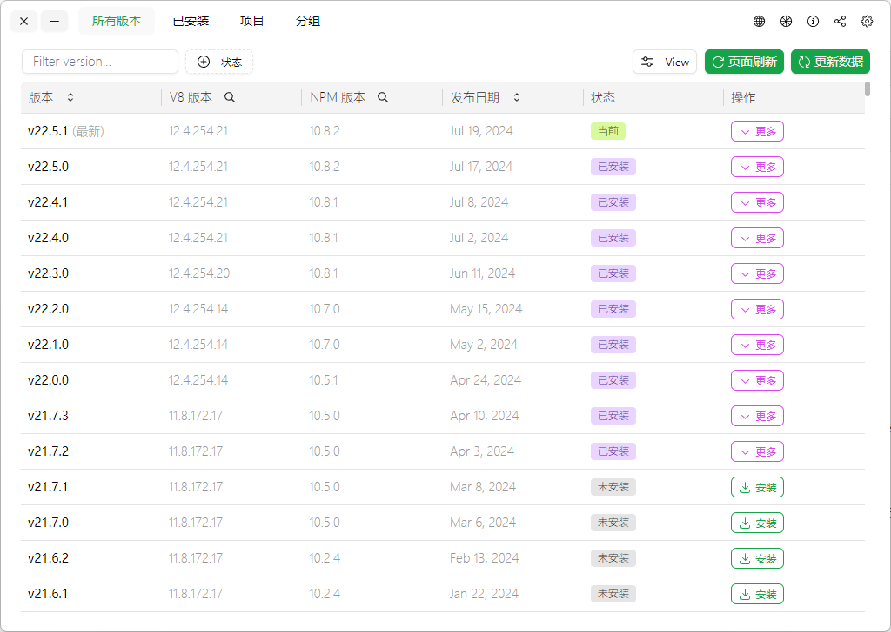

> [!IMPORTANT]
>
> [项目地址](https://github.com/1111mp/nvm-desktop)

- 支持的平台：

| 平台    | 是否支持 |
| :------ | :------- |
| Windows | ✅        |
| Linux   | ✅        |
| Mac     | ✅        |


# 第二章：包管理工具

## 2.1 npm

* npm (Node Package Manager)：Node.js 的默认包管理工具。

## 2.2 yarn

* 由 Facebook 推出，旨在提高包管理的速度和一致性。

> [!NOTE]
>
> 可以通过 `npm -g install yarn`命令安装。

* 项目截图：

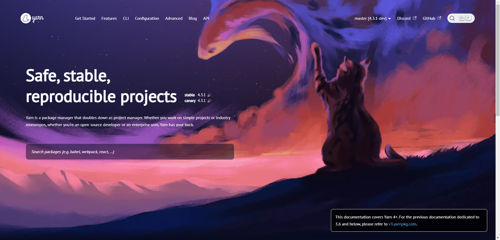

> [!IMPORTANT]
>
> * [官网](https://yarnpkg.com/)
> * [项目地址](https://github.com/yarnpkg/berry)

## 2.3 pnpm

* 快速的，节省磁盘空间的包管理工具。

> [!NOTE]
>
> 可以通过 `npm -g install pnpm`命令安装。

* 项目截图：


> [!IMPORTANT]
>
> * [官网](https://pnpm.io/)
> * [项目地址](https://github.com/pnpm/pnpm)


# 第三章：项目构建工具

## 3.1 webpack

* 一个模块打包器，可以将多种资源（JavaScript、CSS、图片等）打包成一个或多个 bundle。

* 项目截图：


> [!IMPORTANT]
>
> * [官网](https://webpack.js.org/)
> * [项目地址](https://github.com/webpack/webpack)

## 3.2 Parcel

* 零配置的 Web 应用程序打包工具。

* 项目截图：


> [!IMPORTANT]
>
> * [官网](https://parceljs.org/)
> * [项目地址](https://github.com/parcel-bundler/parcel)

## 3.3 Vite

* Vite 是一个新型前端构建工具，旨在提高开发效率，特别是对现代前端框架（如 Vue 和 React）提供了良好的支持。

* 项目截图：


> [!IMPORTANT]
>
> * [官网](https://vitejs.dev/)
> * [项目地址](https://github.com/vitejs/vite)


# 第四章：前端框架和库

## 4.1 React

* Facebook 开发的一个用于构建用户界面的 JavaScript 库。

* 项目截图：

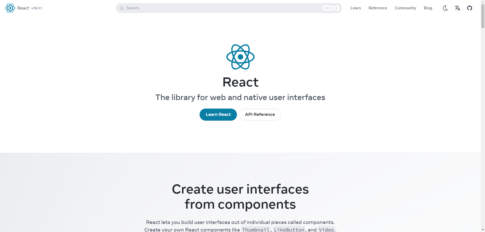

> [!IMPORTANT]
>
> * [官网](https://react.dev/)
> * [项目地址](https://github.com/facebook/react/releases)

## 4.2 Vue

* 一个渐进式 JavaScript 框架，用于构建用户界面。

* 项目截图：

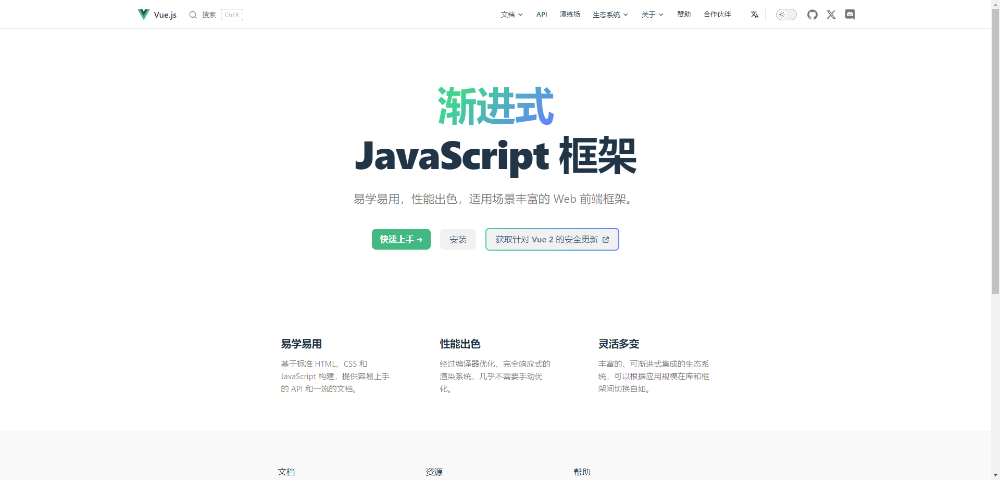

> [!IMPORTANT]
>
> * [官网](https://cn.vuejs.org/)
> * [项目地址](https://github.com/vuejs/)

## 4.3 Angular

* Google 开发的一个用于构建单页应用的前端框架。

* 项目截图：

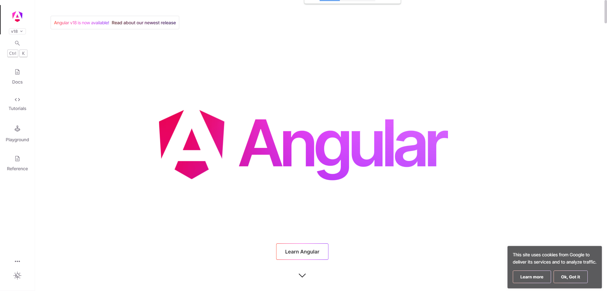

> [!IMPORTANT]
>
> * [官网](https://angular.dev/)
> * [项目地址](https://github.com/angular/angular)


# 第五章：CSS 预处理器和框架

## 3.1 Sass

* 一个 CSS 预处理器，提供了变量、嵌套和混合等特性。

* 项目截图：


> [!IMPORTANT]
>
> * [官网](https://sass-lang.com/)
> * [项目地址](https://github.com/sass)

## 3.2 Less

* 一个 CSS 预处理器，与 Sass 类似，具有不同的语法。

* 项目截图：

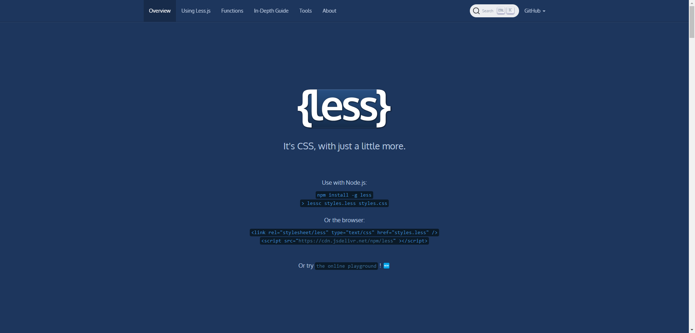

> [!IMPORTANT]
>
> * [官网](https://lesscss.org/)
> * [项目地址](https://github.com/less/less.js)

## 3.3 Tailwind CSS

* 一个实用优先的 CSS 框架，提供了大量的低级实用工具类。

* 项目截图：


> [!IMPORTANT]
>
> * [官网](https://tailwindcss.com/)
> * [项目地址](https://github.com/tailwindlabs/tailwindcss)


# 第六章：测试工具

## 6.1 Jest

* 一个由 Facebook 开发的 JavaScript 测试框架，主要用于 React 应用程序的测试。

* 项目截图：

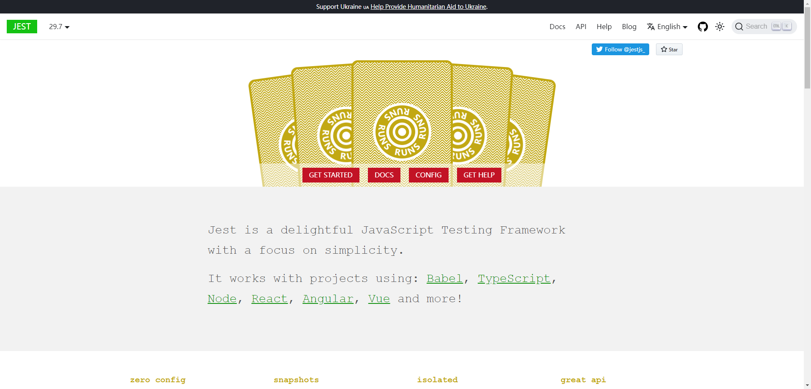

> [!IMPORTANT]
>
> * [官网](https://jestjs.io/)
> * [项目地址](https://github.com/jestjs/jest)

## 6.2 Mocha

* 一个灵活的 JavaScript 测试框架，支持异步测试。

* 项目截图：


> [!IMPORTANT]
>
> * [官网](https://mochajs.org/)
> * [项目地址](https://github.com/mochajs/mocha)

## 6.3 Chai

* Chai 是一个用于节点和浏览器的 BDD / TDD 断言库，可以愉快地与任何 javascript 测试框架配对。

* 项目截图：

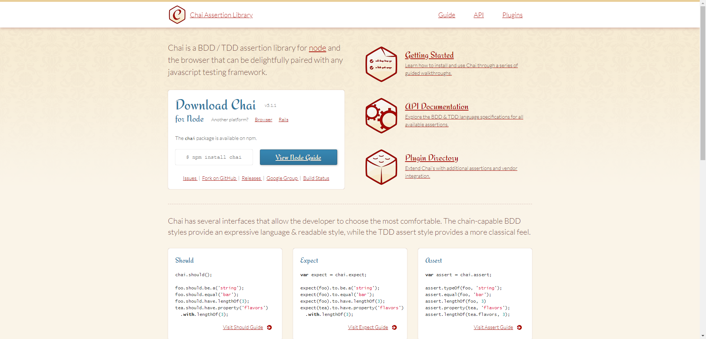

> [!IMPORTANT]
>
> * [官网](https://www.chaijs.com/)
> * [项目地址](https://github.com/chaijs/chai)

## 6.4 Cypress

* 借助 Cypress，我们可以轻松地为现代 Web 应用程序创建测试，对其进行可视化调试，并在持续集成版本中自动运行它们。

* 项目截图：


> [!IMPORTANT]
>
> [官网](https://www.cypress.io/)


# 第七章：UI 组件库

## 7.1 Naive UI

* Naive UI 是一个基于 Vue 的组件库（Vue 3.x）。
* 项目截图：

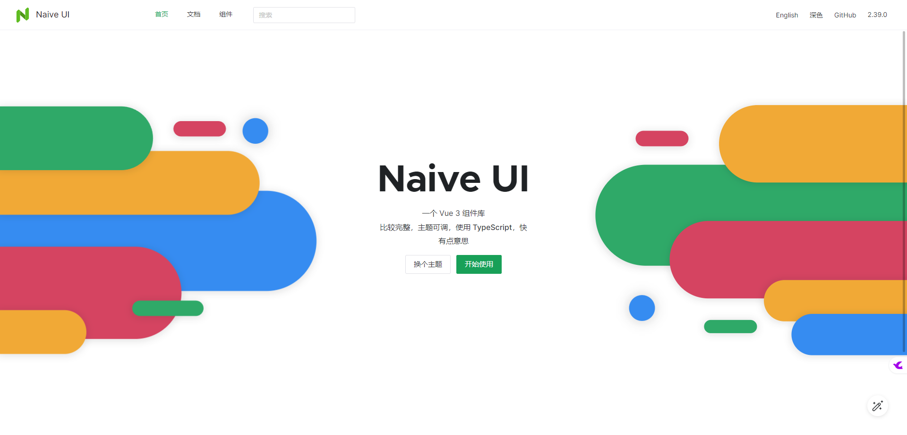

> [!IMPORTANT]
>
> * [官网](https://www.naiveui.com/)
> * [项目地址](https://github.com/tusen-ai/naive-ui)

* 支持的框架或库：

| 框架或库 | 是否支持 |
| :------- | :------- |
| React    | ❎        |
| Vue      | ✅        |
| Angular  | ❎        |

## 7.2 Ant Design Vue

* `Ant Design Vue` 为 Web 应用提供了丰富的基础 UI 组件，将持续探索企业级应用的最佳 UI 实践。
* 项目截图：

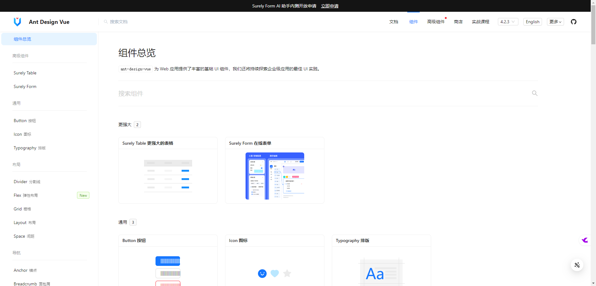

> [!IMPORTANT]
>
> * [官网](https://antdv.com/)
> * [项目地址](https://github.com/vueComponent/ant-design-vue)

* 支持的框架或库：

| 框架或库 | 是否支持 |
| :------- | :------- |
| React    | ❎        |
| Vue      | ✅        |
| Angular  | ❎        |