# 第一章：编译器

## 1.1 MSVC（Microsoft Visual C++）

### 1.1.1 概述

* MSVC 是微软开发的一套编译工具，广泛用于 Windows 操作系统下的 C/C++ 程序开发。它集成在 Visual Studio IDE 中，并且提供了强大的调试功能。

### 1.1.2 项目

* 项目截图：

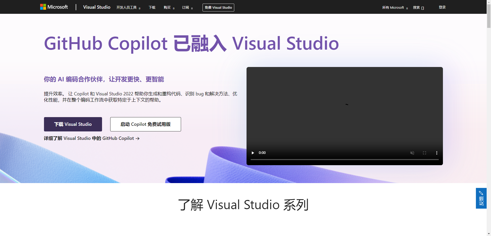

### 1.1.2 平台（操作系统）

- 支持的平台：

| 平台    | 是否支持 |
| :------ | :------- |
| Windows | ✅        |
| Linux   | ❎        |
| Mac     | ❎        |

## 1.2 GCC（GNU Compiler Collection）

### 1.2.2 概述

* GCC 是一个支持多种编程语言的编译器套件，广泛用于 C 和 C++ 语言编译。它是开源软件项目的一部分，并且在 Unix 和 Linux 环境中非常流行。

### 1.2.2 项目

* 项目截图：

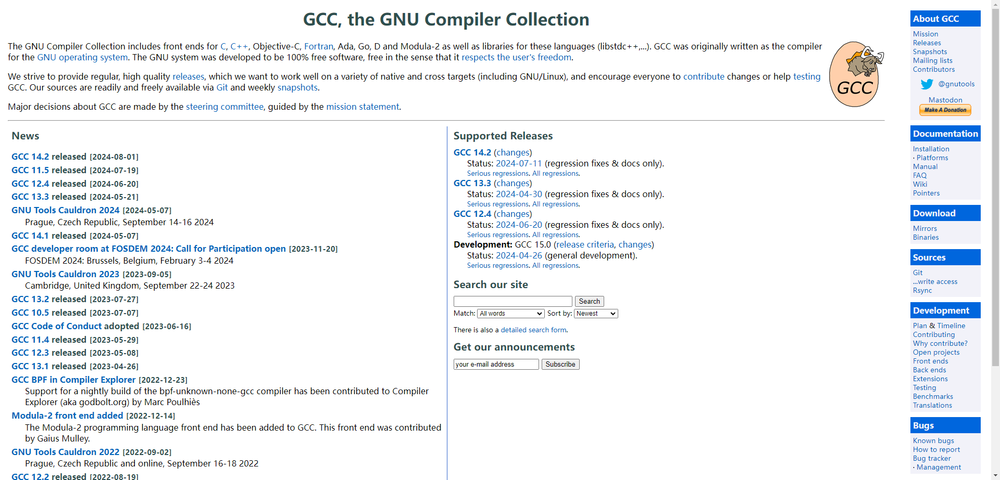

* [官网](https://gcc.gnu.org/)。

### 1.2.3 平台（操作系统）

- 支持的平台：

| 平台    | 是否支持 |
| :------ | :------- |
| Windows | ✅        |
| Linux   | ✅        |
| Mac     | ✅        |

## 1.3 Clang/LLVM

### 1.3.1 概述

* Clang 是一个基于 LLVM 架构的 C/C++ 编译器，提供了 GCC 的替代方案。它拥有快速的编译速度、现代化的代码分析工具和优异的错误诊断功能。

### 1.3.2 项目

* 项目截图：

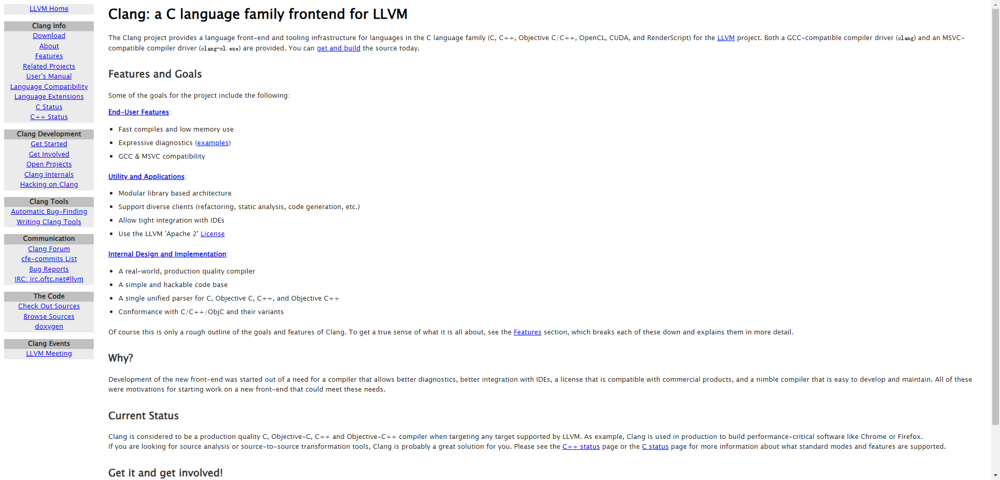

* [官网](https://clang.llvm.org/)。

### 1.3.3 平台（操作系统）

- 支持的平台：

| 平台    | 是否支持 |
| :------ | :------- |
| Windows | ✅        |
| Linux   | ✅        |
| Mac     | ✅        |

## 1.4 MinGW (Minimalist GNU for Windows)

### 1.4.1 概述

* MinGW 提供了一组开源的编译工具，其中包括 GCC 编译器，专门为 Windows 平台编译 C 和 C++ 代码而设计。它使得在 Windows 平台上使用 GNU 编译器成为可能。

> [!NOTE]
>
> Cygwin 是基于 MinGW  的图形化界面，而 MSYS2 是结合了 MinGW 和 Cygwin 的工具集，并且支持强大的软件包管理系统。

### 1.4.2 项目

* 项目截图：

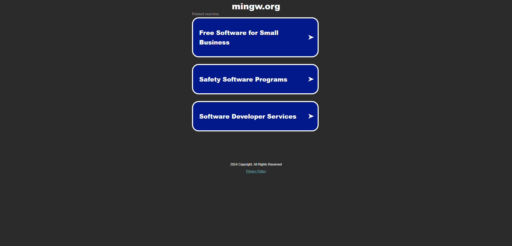

* [官网](https://www.mingw.org/)。

### 1.4.3 平台（操作系统）

- 支持的平台：

| 平台    | 是否支持 |
| :------ | :------- |
| Windows | ✅        |
| Linux   | ❎        |
| Mac     | ❎        |

# 第二章：集成开发环境（IDE）

## 2.1 Visual Studio

### 2.1.1 概述

* 由微软开发，功能强大，集成了代码编辑、编译、调试等多种功能。适用于 Windows 平台的大型项目开发。

### 2.1.2 项目

* 项目截图：

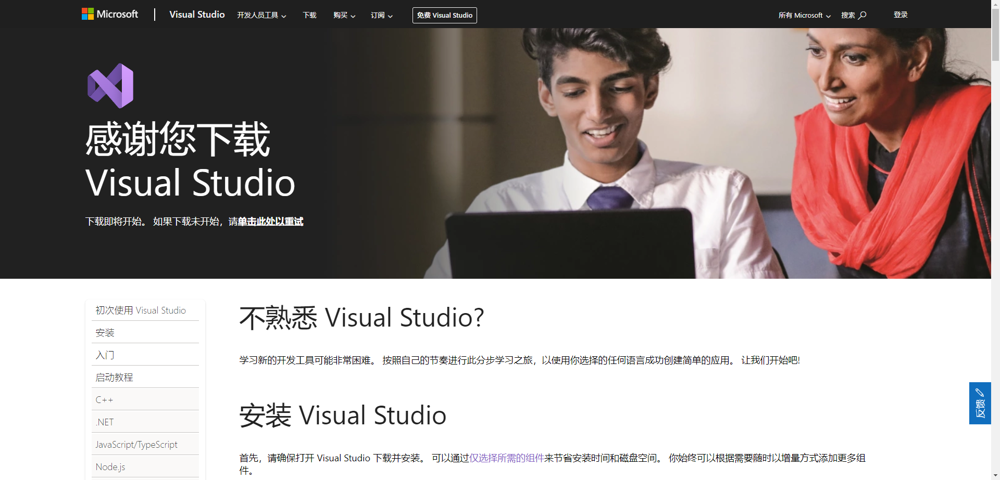

* [官网](https://visualstudio.microsoft.com/zh-hans/)。

### 2.1.3 平台（操作系统）

- 支持的平台：

| 平台    | 是否支持 |
| :------ | :------- |
| Windows | ✅        |
| Linux   | ❎        |
| Mac     | ❎        |

## 2.2 CLion

### 2.2.1 概述

* CLion 是由 JetBrains 开发的一款功能强大的跨平台 C/C++ 集成开发环境（IDE）。CLion 支持多种构建系统，如： CMake、Makefile、调试器和版本控制系统，提供智能代码补全、代码分析、重构和导航功能，适合中大型 C/C++ 项目的开发。

### 2.2.2 项目

* 项目截图：

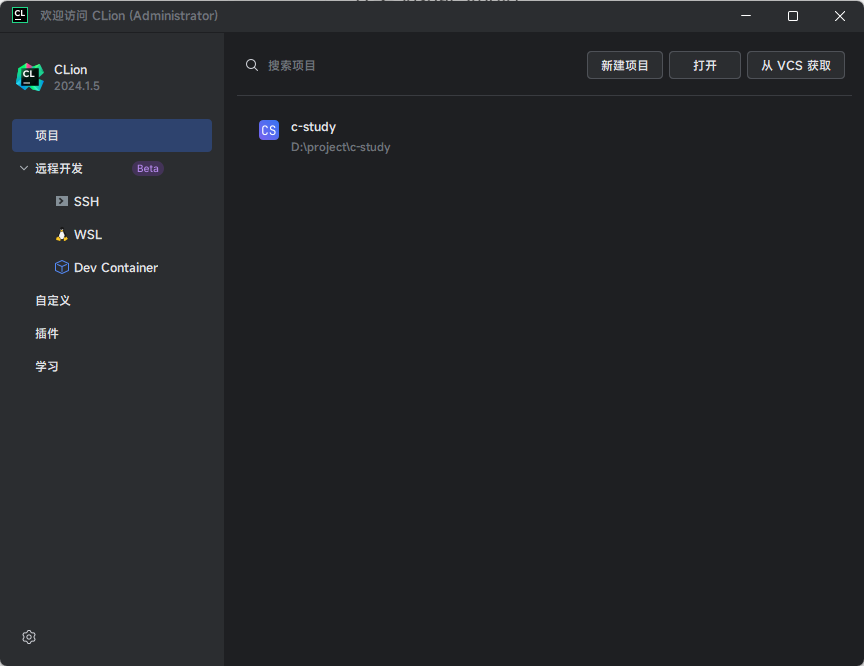

* [官网](https://www.jetbrains.com/clion/)。

### 2.2.3 平台（操作系统）

- 支持的平台：

| 平台    | 是否支持 |
| :------ | :------- |
| Windows | ✅        |
| Linux   | ✅        |
| Mac     | ✅        |

## 2.3 Qt Creator

### 2.3.1 概述

* Qt Creator 是一个跨平台的 C++ 图形用户界面（GUI）框架和开发工具集，它不仅支持 GUI 应用程序开发，还支持嵌入式系统、命令行工具和网络服务的开发。Qt 拥有丰富的库和工具，可以帮助开发者快速构建高性能的应用程序。

### 2.3.2 项目

* 项目截图：

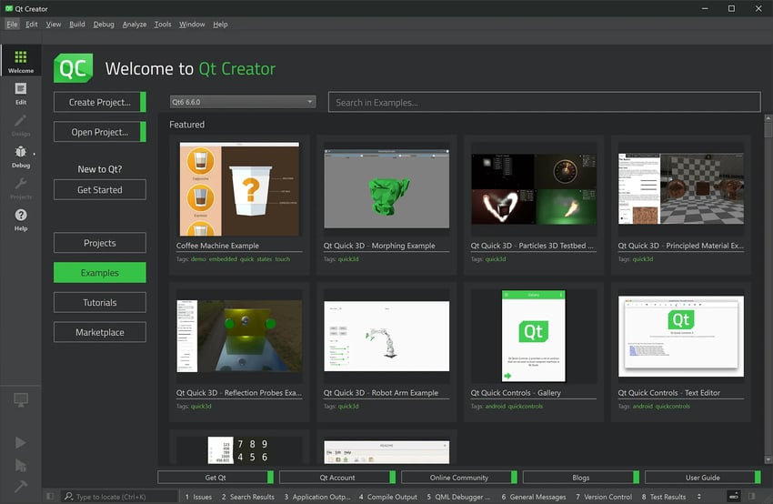

* [官网](https://www.qt.io/)。

### 2.3.3 平台（操作系统）

- 支持的平台：

| 平台    | 是否支持 |
| :------ | :------- |
| Windows | ✅        |
| Linux   | ✅        |
| Mac     | ✅        |

## 2.4 VS Code

### 2.4.1 概述

* Visual Studio Code (VS Code) 是一个免费的开源代码编辑器。它支持语法高亮、智能代码补全（IntelliSense）、内置调试工具和 Git 集成。用户可以通过扩展来添加更多功能，如：支持新的编程语言、主题和调试工具。VS Code 还支持在微软 Azure 上进行部署和托管，适用于各种编程语言和框架。

> [!NOTE]
>
> - ① Visual Studio Code 需要安装对应的插件，才能运行 C/C++ 代码。
> - ② Visual Studio Code 除了开源免费的优点之外，还有一个优点就是插件巨多（几乎所有主流的编程语言都提供有对应的插件），这也是很多程序员喜欢使用它的原因。

### 2.4.2 项目

* 项目截图：

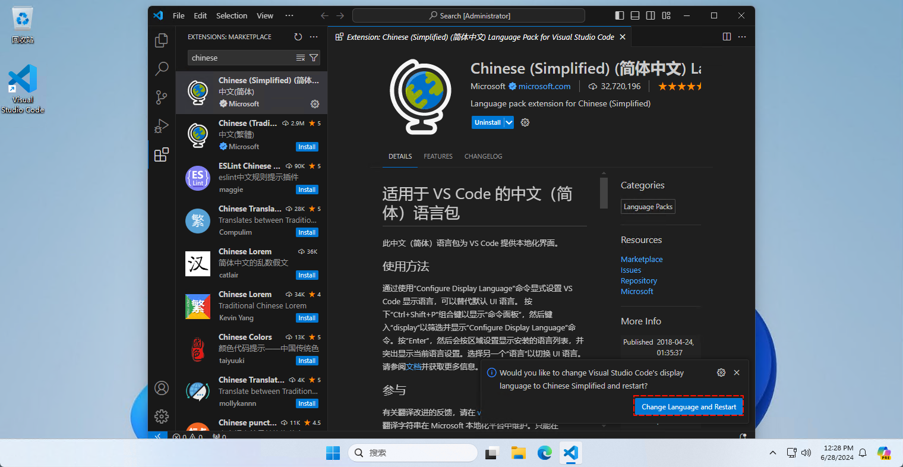

* [官网](https://code.visualstudio.com/)。

### 2.4.3 平台（操作系统）

- 支持的平台：

| 平台    | 是否支持 |
| :------ | :------- |
| Windows | ✅        |
| Linux   | ✅        |
| Mac     | ✅        |

# 第三章：项目构建工具

## 3.1 Make

### 3.1.1 概述

* Make 是一种自动化工具，主要用于编译和构建程序。它通过解析 `Makefile` 文件中定义的规则，来确定哪些部分需要重新编译以及如何进行编译。Make 是 Unix/Linux 环境下非常流行的构建工具，适合处理复杂的编译依赖关系。

### 3.1.2 项目

* 项目截图：

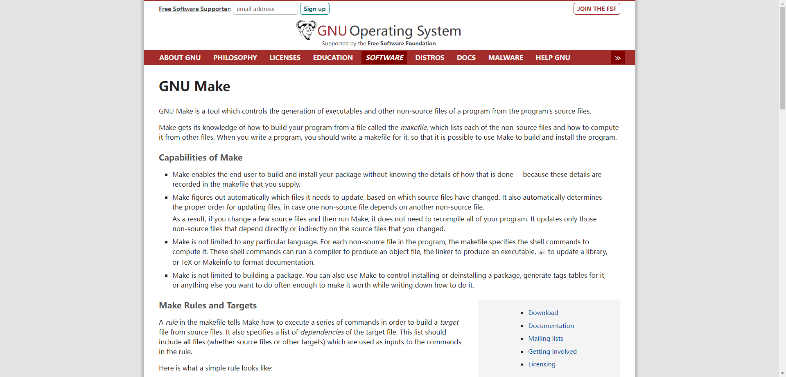

* [官网](https://www.gnu.org/software/make/)。

### 3.1.3 平台（操作系统）

- 支持的平台：

| 平台    | 是否支持                                          |
| :------ | :------------------------------------------------ |
| Windows | ❎（也可以在 Windows 上通过 Cygwin 或 MinGW 使用） |
| Linux   | ✅                                                 |
| Mac     | ❎                                                 |

## 3.2 CMake

### 3.2.1 概述

* CMake 是一个跨平台的构建系统生成工具，它通过平台无关的配置文件（如 `CMakeLists.txt`）生成特定平台上的构建文件（如 Makefile、Visual Studio 项目文件）。CMake 非常灵活，可以用于生成适用于不同平台和编译器的构建配置，适合大型跨平台项目。

### 3.2.2 项目

* 项目截图：

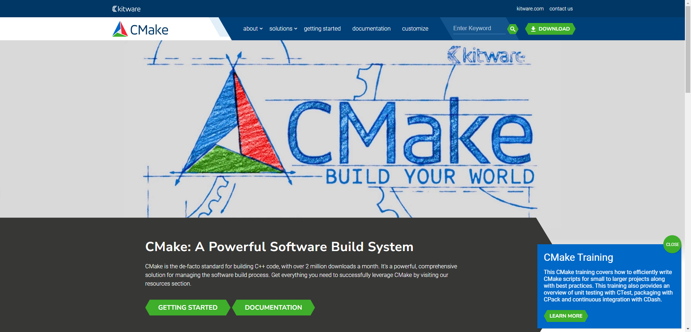

* [官网](https://cmake.org/)。

### 3.2.3 平台（操作系统）

- 支持的平台：

| 平台    | 是否支持                                          |
| :------ | :------------------------------------------------ |
| Windows | ❎（也可以在 Windows 上通过 Cygwin 或 MinGW 使用） |
| Linux   | ✅                                                 |
| Mac     | ❎                                                 |

## 3.3 Ninja

### 3.3.1 概述

* Ninja 是一个注重速度的小型构建系统，旨在用作其他构建系统（如 CMake）的底层构建工具。Ninja 专注于快速的增量构建，适合在大型代码库中频繁编译的场景。它通过 `build.ninja` 文件定义构建规则，并能显著减少编译时间。

### 3.3.2 项目

* 项目截图：

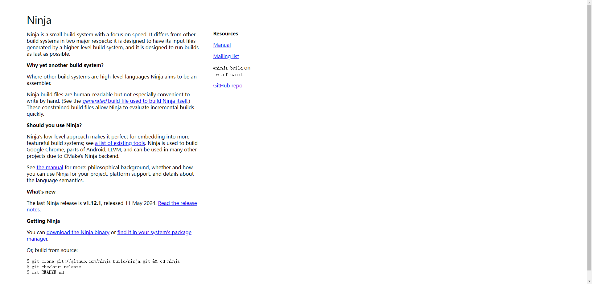

* [官网](https://ninja-build.org/)。

### 3.3.3 平台（操作系统）

- 支持的平台：

| 平台    | 是否支持 |
| :------ | :------- |
| Windows | ✅        |
| Linux   | ✅        |
| Mac     | ✅        |

# 第四章：调试工具

1. **GDB (GNU Debugger)**:
   - 用途：开源调试器，支持多种编程语言，包括C和C++。
   - 特点：广泛应用于Linux和Unix平台。

2. **LLDB**:
   - 特点：基于LLVM的调试器，支持多种编程语言，包括C和C++。
   - 适用场景：与Clang配合使用，性能优越。

3. **Visual Studio Debugger**:
   - 用途：集成在Visual Studio中的调试器，功能强大。
   - 适用场景：Windows平台开发。

# 第五章：静态代码分析工具

1. **Cppcheck**:
   - 用途：开源静态代码分析工具，检测C/C++代码中的错误和潜在问题。
   - 特点：易于集成到CI/CD管道中。

2. **Clang Static Analyzer**:
   - 特点：基于Clang的静态分析工具，具有优秀的错误检测能力。

3. **PVS-Studio**:
   - 用途：商业静态代码分析工具，支持多种编程语言，包括C和C++。
   - 特点：提供详细的错误报告和修复建议。

# 第六章：版本控制系统

1. **Git**:
   - 用途：分布式版本控制系统，管理代码变更。
   - 工具：常用的Git GUI工具包括GitHub Desktop、GitKraken、Sourcetree等。

2. **SVN (Subversion)**:
   - 特点：集中式版本控制系统，适合对历史版本和代码审查要求严格的项目。

# 第七章：性能分析和优化工具

1. **Valgrind**:
   - 用途：内存调试、内存泄漏检测和性能分析工具。
   - 特点：广泛应用于Linux平台。

2. **gprof**:
   - 特点：GNU Profiler，性能分析工具，生成程序的执行时间报告。

3. **perf**:
   - 用途：Linux平台上的性能分析工具，支持CPU性能分析和系统监控。

# 第八章：单元测试框架

1. **Google Test (gtest)**:
   - 用途：流行的C++单元测试框架，支持编写和运行测试用例。
   - 特点：与CMake集成良好，易于使用。

2. **Catch2**:
   - 特点：C++单元测试框架，支持现代C++特性，语法简洁。

3. **CppUnit**:
   - 用途：C++的单元测试框架，基于JUnit的设计。

# 第九章：包管理工具

1. **Conan**:
   - 用途：跨平台的C/C++包管理工具，支持依赖管理和版本控制。
   - 特点：与CMake、Visual Studio等构建系统集成良好。

2. **vcpkg**:
   - 特点：微软提供的开源C/C++包管理工具，支持Windows、Linux和macOS。

